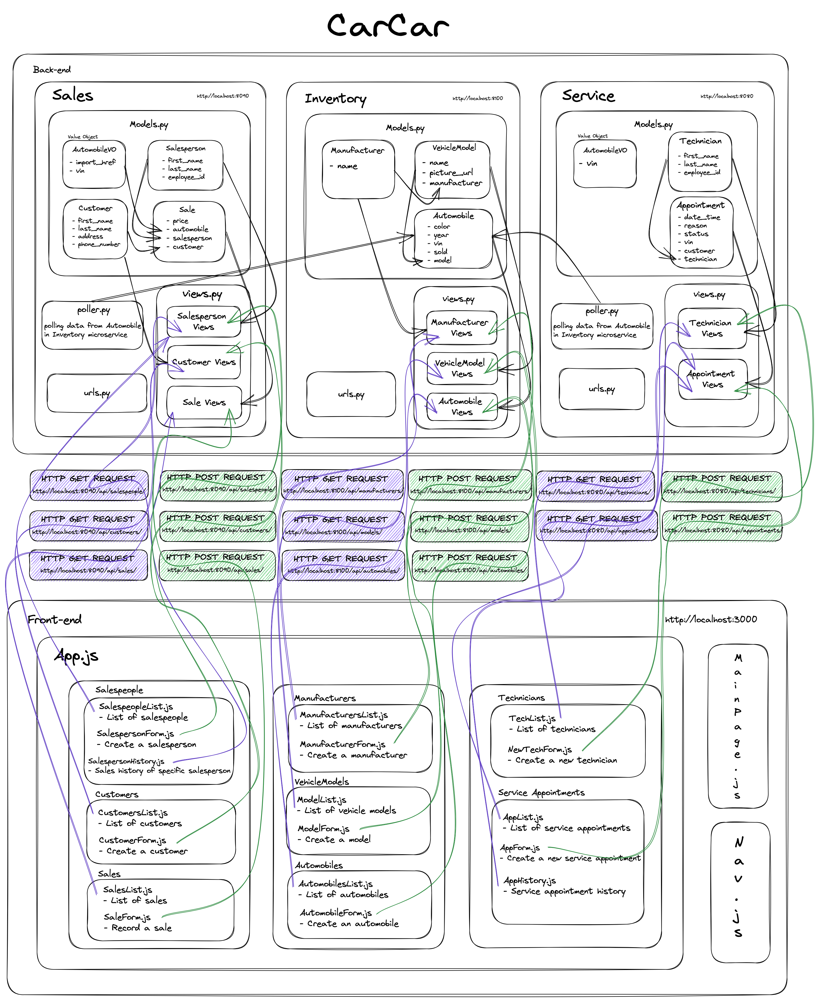

# CarCar

Team:

* Sohoan Hua - Service Microservice
* Kristen Lungstrum - Sales Microservice

## How to run this project
1. Clone this repository

> git clone https://gitlab.com/hoanhua/project-beta

2. Change your current directory to the project's directory

> cd project-beta

3. Run Docker and run the following commands to build and start the Docker container

> docker volume create beta-data
>
> docker-compose build
>
> docker-compose up

 - When you run docker-compose up, if you're on macOS, you might see a warning about an environment variable named OS being missing. You can safely ignore this.

 4. You can access the website at http://localhost:3000/

## Design
<details>
<summary>Diagram</summary>



</details>

## Inventory microservice

**The API**

This application comes with a fully-accessible Inventory API that can keep track of the automobile inventory for the automobile dealership.

It has fully functional RESTful endpoints for the following entities:

- Manufacturer: the company that manufactures the automobile

- VehicleModel: the model of a vehicle created by the manufacturer

- Automobile: the actual automobile of a specific vehicle model

The following documentation describes the available functionality in the Inventory API:

**Manufacturers**

| Action      | Method | URL     |
| :---        |    :----   |          :--- |
| List manufacturers      | GET      | http://localhost:8100/api/manufacturers/   |
| Create a manufacturer   | POST        | http://localhost:8100/api/manufacturers/  |
| Show manufacturer details | GET | http://localhost:8100/api/manufacturers/:id/ |
| Update a manufacturer | PUT | http://localhost:8100/api/manufacturers/:id/|
| Delete a smanufacturer | DELETE | http://localhost:88100/api/manufacturers/:id/ |

<details>
<summary>GET Output Examples</summary>

List manufacturers
```
{
	"manufacturers": [
		{
			"href": "/api/manufacturers/1/",
			"id": 1,
			"name": "Chrysler"
		}
	]
}
```
Show manufacturer details
```
{
	"href": "/api/manufacturers/1/",
	"id": 1,
	"name": "Chrysler"
}
```

</details>

<details>
<summary>POST and PUT Input and Output Examples</summary>

Create and update a manufacturer - input
```
{
  "name": "Chrysler"
}
```

Create and update a manufacturer - output
```
{
	"href": "/api/manufacturers/1/",
	"id": 1,
	"name": "Chrysler"
}
```

</details>

<details>
<summary>DELETE Output Example</summary>

Delete a manufacturer - output
```
{
	"id": null,
	"name": "Chrysler"
}
```

</details>

**Vehicle Models**

| Action      | Method | URL     |
| :---        |    :----   |          :--- |
| List vehicle models      | GET      | http://localhost:8100/api/models/   |
| Create a vehicle model   | POST        | http://localhost:8100/api/models/  |
| Show vehicle model details | GET | http://localhost:8100/api/models/:id/ |
| Update a vehicle model | PUT | http://localhost:8100/api/models/:id/|
| Delete a vehicle model | DELETE | http://localhost:8100/api/models/:id/ |

<details>
<summary>GET Output Examples</summary>

List vehicle models
```
{
	"models": [
		{
			"href": "/api/models/1/",
			"id": 1,
			"name": "Sebring",
			"picture_url": "https://upload.wikimedia.org/wikipedia/commons/thumb/7/71/Chrysler_Sebring_front_20090302.jpg/320px-Chrysler_Sebring_front_20090302.jpg",
			"manufacturer": {
				"href": "/api/manufacturers/1/",
				"id": 1,
				"name": "Chrysler"
			}
		}
	]
}
```
Show vehicle model details
```
{
	"href": "/api/models/1/",
	"id": 1,
	"name": "Sebring",
	"picture_url": "https://upload.wikimedia.org/wikipedia/commons/thumb/7/71/Chrysler_Sebring_front_20090302.jpg/320px-Chrysler_Sebring_front_20090302.jpg",
	"manufacturer": {
		"href": "/api/manufacturers/1/",
		"id": 1,
		"name": "Chrysler"
	}
}
```

</details>

<details>
<summary>POST and PUT Input and Output Examples</summary>

Create and update a vehicle model - input
```
{
  "name": "Sebring",
  "picture_url": "https://upload.wikimedia.org/wikipedia/commons/thumb/7/71/Chrysler_Sebring_front_20090302.jpg/320px-Chrysler_Sebring_front_20090302.jpg",
  "manufacturer_id": 1
}
```

Create and update a vehicle model - output
```
{
	"href": "/api/models/1/",
	"id": 1,
	"name": "Sebring",
	"picture_url": "https://upload.wikimedia.org/wikipedia/commons/thumb/7/71/Chrysler_Sebring_front_20090302.jpg/320px-Chrysler_Sebring_front_20090302.jpg",
	"manufacturer": {
		"href": "/api/manufacturers/1/",
		"id": 1,
		"name": "Chrysler"
	}
}
```

</details>

<details>
<summary>DELETE Output Example</summary>

Delete a vehicle model - output
```
{
	"id": null,
	"name": "Sebring",
	"picture_url": "https://upload.wikimedia.org/wikipedia/commons/thumb/7/71/Chrysler_Sebring_front_20090302.jpg/320px-Chrysler_Sebring_front_20090302.jpg",
	"manufacturer": {
		"href": "/api/manufacturers/1/",
		"id": 1,
		"name": "Chrysler"
	}
}
```

</details>


**Automobiles**

| Action      | Method | URL     |
| :---        |    :----   |          :--- |
| List automobiles      | GET      | http://localhost:8100/api/automobiles/   |
| Create an automobile   | POST        | http://localhost:8100/api/automobiles/  |
| Show automobile details | GET | http://localhost:8100/api/automobiles/:id/ |
| Update an automobile | PUT | http://localhost:8100/api/automobiles/:id/|
| Delete an automobile | DELETE | http://localhost:8100/api/automobiles/:id/ |

<details>
<summary>GET Output Examples</summary>

List automobiles
```
{
	"autos": [
		{
			"href": "/api/automobiles/1C3CC5FB2AN120177/",
			"id": 4,
			"color": "Red",
			"year": 2012,
			"vin": "1C3CC5FB2AN120177",
			"model": {
				"href": "/api/models/2/",
				"id": 2,
				"name": "Wrangler",
				"picture_url": "https://static.summitracing.com/global/images/prod/xlarge/omx-1160101_sn_xl.jpg",
				"manufacturer": {
					"href": "/api/manufacturers/2/",
					"id": 2,
					"name": "Jeep"
				}
			},
			"sold": true
		}
	]
}
```
Show automobile details
```
{
	"href": "/api/automobiles/1C3CC5FB2AN120177/",
	"id": 4,
	"color": "Red",
	"year": 2012,
	"vin": "1C3CC5FB2AN120177",
	"model": {
		"href": "/api/models/2/",
		"id": 2,
		"name": "Wrangler",
		"picture_url": "https://static.summitracing.com/global/images/prod/xlarge/omx-1160101_sn_xl.jpg",
		"manufacturer": {
			"href": "/api/manufacturers/2/",
			"id": 2,
			"name": "Jeep"
		}
	},
	"sold": true
}
```

</details>

<details>
<summary>POST and PUT Input and Output Examples</summary>

Create and update an automobile - input
```
{
  "color": "red",
  "year": 2012,
  "vin": "1C3CC5FB2AN120172",
  "model_id": 2
}
```

Create and update an automobile - output
```
{
	"href": "/api/automobiles/1C3CC5FB2AN120177/",
	"id": 4,
	"color": "Red",
	"year": 2012,
	"vin": "1C3CC5FB2AN120177",
	"model": {
		"href": "/api/models/2/",
		"id": 2,
		"name": "Wrangler",
		"picture_url": "https://static.summitracing.com/global/images/prod/xlarge/omx-1160101_sn_xl.jpg",
		"manufacturer": {
			"href": "/api/manufacturers/2/",
			"id": 2,
			"name": "Jeep"
		}
	},
	"sold": true
}
```

</details>

<details>
<summary>DELETE Output Example</summary>

Delete an automobile - output
```
{
	"href": "/api/automobiles/1C3CC5FB2AN120179/",
	"id": null,
	"color": "red",
	"year": 2012,
	"vin": "1C3CC5FB2AN120177",
	"model": {
		"href": "/api/models/2/",
		"id": 2,
		"name": "Wrangler",
		"picture_url": "https://static.summitracing.com/global/images/prod/xlarge/omx-1160101_sn_xl.jpg",
		"manufacturer": {
			"href": "/api/manufacturers/2/",
			"id": 2,
			"name": "Jeep"
		}
	},
	"sold": false
}
```

</details>

## Service microservice

**The API**

This application comes with a fully-accessible Service API that can keep track of service appointments for automobiles and their owners.

It has fully functional RESTful endpoints for the following entities:

- Technician: the technician performing the service for your automobile

- Appointment: the service appointment made for your automobile

- AutomobileVO: a value object used to represent your automobile

The following documentation describes the available functionality in the Service API:

**Technicians**

| Action      | Method | URL     |
| :---        |    :----   |          :--- |
| List technicians      | GET      | http://localhost:8080/api/technicians/   |
| Create a technician   | POST        | http://localhost:8080/api/technicians/  |
| Delete a technician | DELETE | http://localhost:8080/api/technicians/:id/ |

<details>
<summary>GET Output Example</summary>

List technicians
```
{
	"technicians": [
		{
			"first_name": "Mike",
			"last_name": "Jones",
			"employee_id": "123",
			"id": 1
		}
	]
}
```

</details>

<details>
<summary>POST Input and Output Example</summary>

Create a technician - input
```
{
	"first_name": "Mike",
    "last_name": "Jones",
    "employee_id": "123"
}
```

Create a technician - output
```
{
	"first_name": "Mike",
	"last_name": "Jones",
	"employee_id": "123",
	"id": 1
}
```

</details>

<details>
<summary>DELETE Output Example</summary>

Delete a technician - output
```
{
	"deleted": true
}
```

</details>

**Service Appointments**
| Action      | Method | URL     |
| :---        |    :----   |          :--- |
| List appointments      | GET      | http://localhost:8080/api/appointments/   |
| Create an appointment   | POST        | http://localhost:8080/api/appointments/  |
| Delete an appointment | DELETE | http://localhost:8080/api/appointments/:id/ |
| Set appointment status to canceled | PUT | http://localhost:8080/api/appointments/:id/cancel |
| Set appointment status to finished | PUT | http://localhost:8080/api/appointments/:id/finish |

<details>
<summary>GET Output Example</summary>

List service appointments
```
{
	"appointments": [
		{
			"vin": "1C3CC5FB2AN120177",
			"customer": "Fred Jones",
			"date_time": "2023-04-28T01:59:00+00:00",
			"technician": {
				"first_name": "Mike",
				"last_name": "Jones",
				"employee_id": "123",
				"id": 1
			},
			"reason": "Oil Change",
			"status": "",
			"id": 1,
			"Technician": "Mike Jones"
		}
	]
}
```

</details>

<details>
<summary>POST and PUT Input and Output Examples</summary>

Create a service appointment - input
```
{
	"vin": "1C3CC5FB2AN120177",
	"customer": "Fred Jones",
	"date_time": "2023-04-28T01:59:00+00:00",
	"technician": 1,
	"reason": "Oil Change"
}
```

Create a service appointment - output
```
{
    "vin": "1C3CC5FB2AN120177",
	"customer": "Fred Jones",
	"date_time": "2023-04-28T01:59:00+00:00",
	"technician": {
		"first_name": "Mike",
		"last_name": "Jones",
		"employee_id": "123",
		"id": 1
	},
	"reason": "Oil Change",
	"status": "",
	"id": 1,
	"Technician": "Mike Jones"
}
```

Set appointment status to canceled - output
```
{
	"appointments": [
		{
			"vin": "1C3CC5FB2AN120177",
			"customer": "Fred Jones",
			"date_time": "2023-04-28T01:59:00+00:00",
			"technician": {
				"first_name": "Mike",
				"last_name": "Jones",
				"employee_id": "123",
				"id": 1
			},
			"reason": "Oil Change",
			"status": "Canceled",
			"id": 1,
			"Technician": "Mike Jones"
		}
	]
}
```

Set appointment status to finished - output
```
{
	"appointments": [
		{
			"vin": "1C3CC5FB2AN120177",
			"customer": "Fred Jones",
			"date_time": "2023-04-28T01:59:00+00:00",
			"technician": {
				"first_name": "Mike",
				"last_name": "Jones",
				"employee_id": "123",
				"id": 1
			},
			"reason": "Oil Change",
			"status": "Finished",
			"id": 1,
			"Technician": "Mike Jones"
		}
	]
}
```

</details>

<details>
<summary>DELETE Output Example</summary>

Delete a service appointment - output
```
{
	"deleted": true
}
```

</details>

## Sales microservice

**The API**

This application comes with a fully-accessible Sales API that can keep track of automobile sales that come from the inventory.

It has fully functional RESTful endpoints for the following entities:

- Salesperson: the person selling the automobiles

- Customer: the person buying an automobile or utilizing our services

- AutomobileVO: a value object used to represent your automobile

The following documentation describes the available functionality in the Sales API:

**Salespeople**

| Action      | Method | URL     |
| :---        |    :----   |          :--- |
| List salespeople      | GET      | http://localhost:8090/api/salespeople/   |
| Create a salesperson   | POST        | http://localhost:8090/api/salespeople/  |
| Show salesperson details | GET | http://localhost:8090/api/salespeople/:id/ |
| Update a salesperson | PUT | http://localhost:8090/api/salespeople/:id/|
| Delete a salesperson | DELETE | http://localhost:8090/api/salespeople/:id/ |

<details>
<summary>GET Output Examples</summary>

List salespeople
```
{
	"salespeople": [
		{
			"id": 1,
			"first_name": "Bob",
			"last_name": "Jones",
			"employee_id": "123"
		},
	]
}
```
Show person details
```
{
	"id": 1,
	"first_name": "Bob",
	"last_name": "Jones",
	"employee_id": "123"
}
```

</details>

<details>
<summary>POST and PUT Input and Output Examples</summary>

Create and update a salesperson - input
```
{
	"first_name": "Bob",
	"last_name": "Jones",
	"employee_id": "123"
}
```

Create and update a salesperson - output
```
{
	"id": 1,
	"first_name": "Bob",
	"last_name": "Jones",
	"employee_id": "123"
}
```

</details>

<details>
<summary>DELETE Output Example</summary>

Delete a salesperson - output
```
{
	"message": "Salesperson deleted"
}
```

</details>

**Customers**

| Action      | Method | URL     |
| :---        |    :----   |          :--- |
| List customers      | GET      | http://localhost:8090/api/customers/   |
| Create a customer   | POST        | http://localhost:8090/api/customers/  |
| Show customer details | GET | http://localhost:8090/api/customers/:id/ |
| Update a customer | PUT | http://localhost:8090/api/customers/:id/|
| Delete a customer | DELETE | http://localhost:8090/api/customers/:id/ |

<details>
<summary>GET Output Examples</summary>

List customers
```
{
	"customers": [
		{
			"id": 1,
			"first_name": "Fred",
			"last_name": "Jones",
			"address": "123 Elm St.",
			"phone_number": "909-555-5555"
		}
	]
}
```
Show customer details
```
{
	"id": 1,
	"first_name": "Fred",
	"last_name": "Jones",
	"address": "123 Elm St.",
	"phone_number": "909-555-5555"
}
```

</details>

<details>
<summary>POST and PUT Input and Output Examples</summary>

Create and update a customer - input
```
{
	"first_name": "Fred",
	"last_name": "Jones",
	"address": "123 Elm St.",
	"phone_number": "909-555-5555"
}
```

Create and update a customer - output
```
{
	"id": 1,
	"first_name": "Fred",
	"last_name": "Jones",
	"address": "123 Elm St.",
	"phone_number": "909-555-5555"
}
```

</details>

<details>
<summary>DELETE Output Example</summary>

Delete a customer - output
```
{
	"message": "Customer deleted"
}
```

</details>

**Sales**

| Action      | Method | URL     |
| :---        |    :----   |          :--- |
| List sales      | GET      | http://localhost:8090/api/sales/   |
| Create a sale   | POST        | http://localhost:8090/api/sales/  |
| Show sale details | GET | http://localhost:8090/api/sales/:id/ |
| Update a sale | PUT | http://localhost:8090/api/sales/:id/|
| Delete a sale | DELETE | http://localhost:8090/api/sales/:id/ |

<details>
<summary>GET Output Examples</summary>

List sales
```
{
	"sales": [
		{
			"id": 1,
			"price": "50,000",
			"automobile": {
				"import_href": "/api/automobiles/1C3CC5FB2AN120174/",
				"vin": "1C3CC5FB2AN120174"
			},
			"salesperson": {
				"id": 1,
				"first_name": "Bob",
				"last_name": "Jones",
				"employee_id": "123"
			},
			"customer": {
				"id": 1,
				"first_name": "Fred",
				"last_name": "Jones",
				"address": "123 Elm St.",
				"phone_number": "909-555-5555"
			}
		}
	]
}
```
Show sale details
```
{
	"id": 1,
	"price": "50,000",
	"automobile": {
		"import_href": "/api/automobiles/1C3CC5FB2AN120174/",
		"vin": "1C3CC5FB2AN120174"
	},
	"salesperson": {
		"id": 1,
		"first_name": "Bob",
		"last_name": "Jones",
		"employee_id": "123"
	},
	"customer": {
		"id": 1,
		"first_name": "Fred",
		"last_name": "Jones",
		"address": "123 Elm St.",
		"phone_number": "909-555-5555"
    }
}
```

</details>

<details>
<summary>POST and PUT Input and Output Examples</summary>

Create and update a sale - input
```
{
	"price": "50,000",
	"automobile": "1C3CC5FB2AN120174",
	"salesperson": 1,
	"customer": 1
}
```

Create and update a sale - output
```
{
	"id": 1,
	"price": "50,000",
	"automobile": {
		"import_href": "/api/automobiles/1C3CC5FB2AN120174/",
		"vin": "1C3CC5FB2AN120174"
	},
	"salesperson": {
		"id": 1,
		"first_name": "Bob",
		"last_name": "Jones",
		"employee_id": "123"
	},
	"customer": {
		"id": 1,
		"first_name": "Fred",
		"last_name": "Jones",
		"address": "123 Elm St.",
		"phone_number": "909-555-5555"
    }
}
```

</details>

<details>
<summary>DELETE Output Example</summary>

Delete a sale - output
```
{
	"message": "Sale deleted"
}
```

</details>
